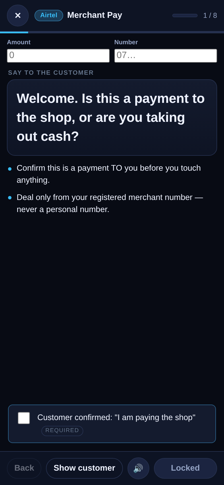

# MM Money Prompter

A step-by-step counter prompter for mobile-money and card merchants in Uganda.
Runs in the browser, installs to the home screen, and works with no network.

Built for **Airtel Money** (`*100#`), **MTN MoMo** (`*165#`) and **VISA card acceptance**,
plus the opening/closing routines around them.



---

## What it actually does

A merchant opens a flow, and the app walks them through one step at a time —
the words to say to the customer, the actions to take on their own phone, and
a checklist they must tick before the app will let them continue.

| | |
|---|---|
| **20 guided flows** | 6 Airtel · 6 MTN · 6 VISA · 2 daily operations |
| **Prompted** | Auto-scrolling large type, optional read-aloud (Web Speech), per-step timer |
| **Gated** | Required checkboxes block *Next* until the discipline is done |
| **Red flags** | Fraud/phishing warnings appear as a full-screen blocking stop |
| **Hand-over view** | One tap shows the customer their side of the script (USSD codes, amount to read back) |
| **Transaction log** | Every transaction, with reference, outcome, auto-calculated commission |
| **Float reconciliation** | Daily cash reconciliation that tells you what the till *should* hold |
| **Z-report** | Per-day and per-type totals, variance, CSV export, print |
| **Offline** | Service worker + IndexedDB; nothing is uploaded anywhere |
| **Backup** | One-tap JSON export/restore |

Flows included:

- **Airtel** — Merchant Pay, Cash In, Cash Out, Airtime, Send Money, Bank/Wallet
- **MTN** — Merchant Pay, Cash In, Cash Out, Airtime, Send Money, Bank/Wallet
- **VISA** — Card payment, Declines, Refunds, Pre-authorisation, Chargebacks, Fraud stop
- **Ops** — Opening float check, End-of-day close

---

## Run it

Any static file server works. ES modules require `http://`, not `file://`.

```bash
cd mmt-prompter
python3 -m http.server 8777
# open http://localhost:8777
```

### Install to a phone home screen

1. Serve it over HTTPS (or `localhost` for testing).
2. Open in Chrome / Edge / Safari.
3. *Add to Home screen* / *Install app*.

It then launches full-screen with no browser chrome, and works offline.

---

## Deploying

Static site, no build step, no runtime dependencies. Any of these work:

| Platform | How |
|---|---|
| **Netlify** | Import the repo. Build command: *(leave blank)*. Publish directory: `.` |
| **Cloudflare Pages** | Import the repo. Build command: *(leave blank)*. Output directory: `.` |
| **Vercel** | Import the repo. Framework preset: *Other*. Output directory: `.` |
| **Any web server** | Copy the files to the document root. |

`netlify.toml`, `vercel.json` and `_headers` are committed and already set the
cache headers.

### Two things that will silently break the app

1. **It must be served over HTTPS.** The service worker, offline mode and the
   install prompt do not work on plain `http://` (except on `localhost`). If it
   loads over HTTP you get a browser-only site with no offline and no
   home-screen install, and no error to tell you why.
2. **Do not give `sw.js` a long cache lifetime.** Browsers do not re-fetch an
   HTTP-cached service worker, so a long CDN TTL means merchants stay pinned to
   an old version forever. All three configs force `no-cache` on `sw.js` and
   `index.html`. When you ship an update, **bump `VERSION` in `sw.js`** — that
   is what actually rolls it out.

### No rewrite rules needed

Routing uses the URL fragment (`#/log`, `#/float`), never path segments, so
there is no SPA fallback to configure. If you ever switch to the History API,
add a catch-all rewrite to `/index.html`.

### After deploying

Open it once over HTTPS, install to the home screen, then **turn off wifi and
confirm it still opens**. That is the only real test of an offline-first app.


---

## First things to do after installing

Open **Settings** and fill in:

1. **Your business** — name, Airtel merchant code, MTN merchant number.
   These get substituted into the customer-facing screens, so you never have to
   remember your own code mid-transaction.
2. **Commission rates** and **limits** — the shipped values are *placeholders*.
   See [VERIFY-BEFORE-LIVE.md](VERIFY-BEFORE-LIVE.md) — this is the one thing you
   must not skip.
3. **Prompter behaviour** — text size, scroll speed, voice.

---

## Design notes

**Why steps are gated.** The prompts encode the things agents actually lose money
on: counting cash twice, reading numbers back, matching the account name, and
not releasing goods before the money lands. A checklist that *blocks* the Next
button is the whole point — it's a training aid that never retires.

**Why red flags are blocking.** A fraud warning that scrolls past in a
side-panel gets ignored in a busy shop. A full-screen stop has to be dismissed.

**Why the float reconciliation exists.** If the cash in the till at close does
not equal what your log says it should, you know something went wrong *today*,
while you still remember what it was. Without it, a 50,000 shilling hole becomes
a mystery three weeks later.

**Money is stored as integer shillings.** Ugandan shillings have no minor unit;
floating point is never used for a value.

**Commission is frozen onto a transaction when you save it.** Changing a rate in
Settings later never rewrites your history — your Z-report for last month is the
Z-report you actually earned.

**Data never leaves the device.** There is no network call anywhere in the app.
Storage is IndexedDB, with a `localStorage` and then in-memory fallback so the
app still runs in a locked-down webview.

---

## Project layout

```
mmt-prompter/
├── index.html              app shell
├── manifest.webmanifest    PWA manifest + home-screen shortcuts
├── sw.js                   offline service worker
├── css/app.css             all styling (no external fonts)
├── icons/                  generated app icons
├── assets/brands/          Airtel / MTN / VISA / Mastercard artwork
├── js/
│   ├── util.js             money, dates, DOM helper, CSV, toasts
│   ├── store.js            IndexedDB → localStorage → memory fallback
│   ├── config.js           all limits/rates, with a placeholder warning
│   ├── flows.js            the 20 transaction scripts  ← edit this to add flows
│   ├── prompter.js         the prompting engine
│   ├── ledger.js           transaction log + editor
│   ├── float.js            daily float reconciliation
│   ├── report.js           Z-report, CSV/JSON export
│   ├── settings.js         profile, rates, limits, data
│   ├── brands.js           brand artwork + card-network preference
│   └── app.js              routing and shell
└── docs/                   screenshots
```

### Brand artwork

The Airtel, MTN MoMo, VISA and Mastercard marks appear on the filter tabs,
flow cards, network group headers, the prompter header and every transaction
log row. They are plain PNG files in `assets/brands/`, precached by the service
worker and preloaded from the shell.

Card flows display either the VISA or the Mastercard mark depending on
**Settings → Prompter behaviour → Primary card network** — Ugandan shops take
both, so there is no single correct default.

**Before publishing to the Play Store, replace these with the official press-kit
files.** See [`BRAND-ASSETS.md`](BRAND-ASSETS.md) for the full list, the
reasoning behind PNG vs base64, and how to swap them.

### Adding a flow

Append an object to `FLOWS` in `js/flows.js`:

```js
{
  id: 'airtel-merchant-pay',
  network: 'airtel',            // airtel | mtn | visa | ops
  title: 'Merchant Pay — the customer pays you',
  short: 'Merchant Pay',
  blurb: 'Shown on the picker card.',
  ussd: '*100#',
  est: '90 sec',
  risk: 'low',                  // low | medium | high
  steps: [
    {
      t: 'Step title',
      say: 'Words to say to the customer (read aloud + auto-scrolled).',
      do: ['What the merchant does on their own phone.'],
      cust: 'Big text to show the customer on screen.',   // optional
      flag: 'Red flag — full-screen stop until acknowledged.',  // optional
      check: [{ t: 'Must be ticked before Next', req: true }],
    },
  ],
}
```

Then add its `id → TX_TYPES` key in `FLOW_TYPE_FOR` (`js/config.js`) so it can be
logged. Add `[YOUR CODE]` / `[YOUR NUMBER]` / `[AMOUNT]` / `[NUMBER]` in the text
and they are substituted live from Settings and the amount/number fields.

---

## Shipping to the Play Store

The app is deliberately structured so the Android wrapper is a thin shell —
no bundler, no framework, no build step. The simplest path is a
**Trusted Web Activity (TWA)**, which gives you a real Play Store listing with
almost no extra code:

```bash
npm i -g @bubblewrap/cli

# 1. host the folder over HTTPS
# 2. in Digital Asset Links, serve /.well-known/assetlinks.json containing:
#    your app's package name + SHA-256 signing certificate fingerprint
#    (see bubblewrap init, which generates it for you)

bubblewrap init --manifest https://your-domain/manifest.webmanifest
bubblewrap build
```

If you later want a real native build instead, the seams are already in place:
all data access is in `store.js`, all money logic in `util.js`/`config.js`, and
the UI is plain ES modules with no DOM-library dependency.

---

## Testing

- `node` logic suite — flow integrity, money maths, float reconciliation,
  brand mapping, placeholder-rates gate (353 assertions)
- Playwright end-to-end — full merchant journey on an emulated Android phone
  (64 assertions): flow filtering, prompter walk with red-flag blocking,
  checklist gating, logging, float, Z-report, settings round-trip, offline
  cache, and layout checks at 320 / 390 / 414 px.

Both suites live outside the shipped app, in a scratch directory — the app
itself has no dependencies and ships nothing test-related.

---

## Limitations

- **Numbers ship as placeholders.** Limits, commission rates and thresholds are
  editable defaults, not verified tariffs. Until the merchant ticks *“I have
  checked these against my provider contracts”* in Settings, the app shows a
  warning on the home screen and in Settings, because the commission figures it
  calculates may be wrong. See [VERIFY-BEFORE-LIVE.md](VERIFY-BEFORE-LIVE.md).
- **English only.** The prompts were written for English; the settings screen
  has a voice picker for read-aloud but no translation layer.
- **Single device, single user.** There is no backend, no login and no sync.
  Everything (transactions, settings, rates) lives in that browser's IndexedDB
  only. Clearing site data, uninstalling, or switching phones **loses it** —
  the app cannot recover it. Settings → Your data exports a full JSON backup;
  do that at the end of every trading day until a real backend exists.
- **No accounts, no central record.** Each shop's data is its own. You cannot
  see another branch's takings, and you cannot revoke a lost phone's access
  remotely.
- **Menu positions are given by label.** Providers renumber their USSD menus
  between versions, so the scripts teach the label ("Cash In"), not the digit.
- **Not a licensed PSP or a compliance tool.** It prompts good practice; it
  does not file suspicious-transaction reports or replace your provider's
  agent training.
